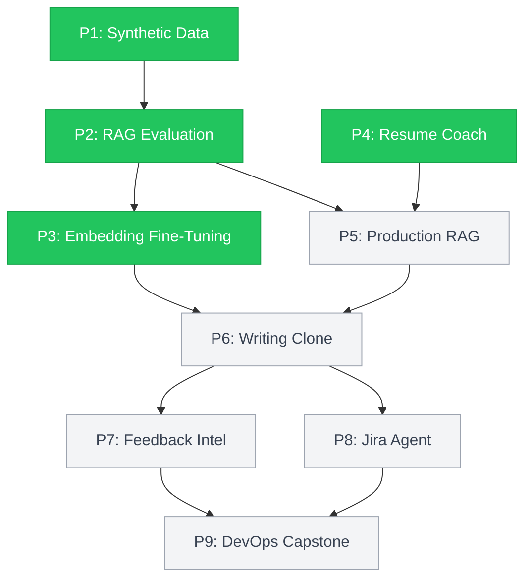

# AI Portfolio: 9 Projects in 8 Weeks

4/9 complete · 1,100+ tests · 17 ADRs · 95%+ coverage

Nine AI engineering projects built end-to-end in 8 weeks (Feb-Apr 2026). Each project has its own README with setup instructions, architecture decisions, and results you can reproduce from committed code.

[LinkedIn](https://linkedin.com/in/jharuby) · [Portfolio Site](https://rubyjha.dev)

## How the Projects Connect

P1 through P4 build the foundations: data quality, retrieval benchmarking, embedding tuning, and evaluation pipelines. P5 through P9 use those foundations to build multi-agent production systems.

---

## P1: Synthetic Data (Home DIY Repair)

I needed validated training data for home repair QA. Most synthetic data pipelines generate and ship. This one generates, validates with a 5-layer pipeline (schema, semantic, LLM-as-Judge, correction loop, re-evaluation), and measures what broke.

The main lesson was about where to fix failures. I tried two approaches: correcting individual records after generation, and improving the generation template itself. Template improvement cut failures by 78%. Individual correction only managed 67%. Upstream fixes win.

The second lesson was about LLM-as-Judge reliability. Out-of-box GPT-4o judging started at 0% failure detection. After calibrating with dual labels (manual + LLM), it reached 20%. You cannot trust LLM judges without calibration against ground truth.

Pydantic + Instructor gave 100% schema validation with zero manual JSON parsing. For production, I'd use upstream template improvement with Pydantic as a structural gate and skip individual record correction unless template fixes plateau.

4 ADRs · 7 charts · Streamlit Story Mode · [Full README](./01-synthetic-data-home-diy/README.md)

---

## P2: Evaluating RAG for Any PDF

16-configuration grid search across chunking strategies, embedding models, and reranking. The output is a reusable benchmarking framework, not a one-off result.

- Best config: semantic chunking + OpenAI embeddings at Recall@5 = 0.625. Adding Cohere reranking pushed it to 0.747 (+19.5%). Reranking was the single biggest lift of any knob I tested.
- OpenAI embeddings beat local models by 26% at $0.02/1M tokens. At that price, local embeddings for retrieval benchmarking are hard to justify unless you need offline capability.
- Faithfulness gap of 0.511. I traced it: 39% of what RAGAS flagged as "hallucinations" were actually LLM refusals. Retrieval quality and generation quality are separate problems, but RAGAS metrics conflate them.
- BM25 lost to 10 of 15 vector configs. Keyword search is not a safe baseline for PDF retrieval.

For production: semantic chunking + OpenAI embeddings + Cohere reranking. The cost is negligible and the recall gain is real.

384+ tests · 5 ADRs · 95% coverage · Click CLI with Rich formatting · [Full README](./02-rag-evaluation/README.md)

---

## P3: Contrastive Embedding Fine-Tuning

Pre-trained embeddings ranked domain-specific pairs wrong. Spearman correlation was -0.22. The model wasn't just inaccurate, it had the ranking backwards.

I applied contrastive fine-tuning (CosineSimilarityLoss) to fix the inversion, then benchmarked standard fine-tuning vs. LoRA (PEFT) across 8 metrics: Spearman, AUC-ROC, Cohen's d, cluster purity, NDCG, MAP, precision, and separation ratio.

After fine-tuning, Spearman hit +0.85. Margin went from -0.083 to +0.940 (AUC-ROC 0.994, Cohen's d 7.73). False positives dropped from 137 to 3.

The LoRA decision came from hardware. I had 8GB RAM on an M2. Full fine-tuning wouldn't fit. LoRA hit 96.9% of standard performance with 0.32% trainable parameters and a 300x smaller model file. The constraint forced what turned out to be the better decision anyway: near-identical quality, a fraction of the resources. I'd pick LoRA for production unless you have evidence the 3.1% gap matters for your specific use case.

112 tests · 3 ADRs · [Full README](./03-fine-tuning-guardrails/README.md)

---

## P4: AI-Powered Resume Coach

I wanted to answer two questions: what makes a resume score well, and does template choice matter?

I generated 250 synthetic resumes across 5 fit levels and 5 writing templates, scored them with GPT-4o-as-Judge (Instructor retry loops), and ran A/B tests on template effectiveness. FastAPI serves the scoring API, ChromaDB stores the vectors.

The fit signal turned out to be simple. Jaccard similarity on skills: excellent=0.669, mismatch=0.005. The gradient is clean. Template formatting is noise compared to actual skill overlap. For production, a Jaccard-based pre-filter before LLM scoring would be cheap, fast, and sufficient as a hard gate.

Template choice matters more than I expected. Casual template failed 34% of the time. Career_changer failed 100%. Chi-squared=32.74, p<0.001, 66-point spread. The worst template isn't slightly worse. It's a complete deal-breaker.

Instructor retry loop corrected 8/8 judge failures. Without it, 8 evaluations would have returned invalid structured output.

532 tests · 5 ADRs · 99% coverage · 9 FastAPI endpoints + ChromaDB · [Full README](./04-resume-coach/README.md)

---

## Upcoming

| # | Project | What it builds on |
|---|---------|-------------------|
| 5 | Production RAG System | P2's winning config, now with multi-strategy chunking, hybrid search, and a REST API |
| 6 | Digital Writing Clone (5-Agent) | P3 embeddings + P5 RAG feeding 5 CrewAI agents: StyleAnalyzer, RAG, Evaluator, Fallback, Planner |
| 7 | Customer Feedback Intelligence | P6's multi-agent pattern applied to a CrewAI pipeline: Sentiment, Theme, Mapping, Gap agents |
| 8 | Jira AI Agent | P5's vector search + P6's agent orchestration for semantic search, duplicate detection, sprint planning |
| 9 | DevOps AI Assistant (Capstone) | All prior patterns into a 5-agent system: CI/CD monitoring, log analysis, root cause, remediation |

---

## Decisions

17 ADRs across 4 projects. Every non-obvious choice documented with context, alternatives, and rationale. Each ADR includes a Java/TS parallel because these AI engineering patterns don't have established conventions yet.

Every project uses the same validation pattern: schema enforcement (Pydantic), semantic checks, LLM-as-Judge scoring, correction loops, and re-evaluation against a fixed baseline. All seeds, model versions, and eval configs are pinned. Every result regenerates from committed code.

LLM cost control: MD5-keyed disk caching, per-call cost logging, model selection by task (GPT-4o-mini for generation, GPT-4o for evaluation). Everything runs on a MacBook Air M2 with 8GB RAM, which drove real architecture choices: LoRA over full fine-tuning in P3 (300x smaller file), streaming evaluation in P2, batch size tuning throughout.

## Tech Stack

| Category | Tools | Why this and not something else |
|----------|-------|------|
| LLM | OpenAI API (GPT-4o-mini / GPT-4o), Instructor, Cohere Rerank | Instructor guarantees structured output with auto-retry. Cost-tiered: mini for generation, full 4o for evaluation. |
| Embeddings | Sentence-Transformers, PEFT/LoRA | Local fine-tuning that fits in 8GB. LoRA made this possible. |
| Vector & Search | FAISS, ChromaDB | FAISS for benchmarking (no server, pure index control). ChromaDB for production (persistence + metadata filtering). P4 singleton bug is why I don't use ChromaDB for experiments. |
| Evaluation | RAGAS, Braintrust | RAGAS for standardized retrieval metrics (Recall@k, faithfulness). Braintrust because I needed to compare 16 configs side-by-side. |
| Frameworks | LangChain, CrewAI, FastAPI | LangChain for RAG orchestration. CrewAI for multi-agent (P6-P9). FastAPI for production endpoints. |
| Validation | Pydantic v2 | Every LLM output hits a Pydantic model before anything downstream sees it. Caught format issues that aggregate metrics missed. |
| Frontend | Streamlit, Rich, Matplotlib, Seaborn | Streamlit for interactive demos. Rich for CLI output. Matplotlib/Seaborn for charts. |
| DevOps | Click CLI, pytest, ruff, uv, GitHub Actions | uv for fast dependency resolution. ruff over black+isort. Click for composable CLI commands. |
